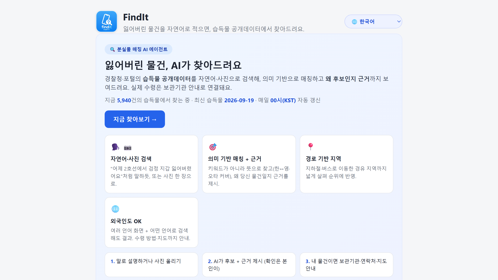
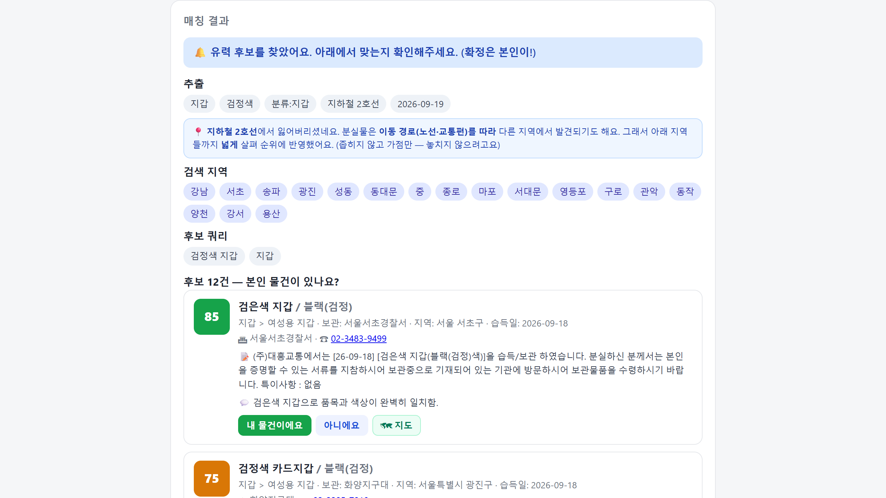
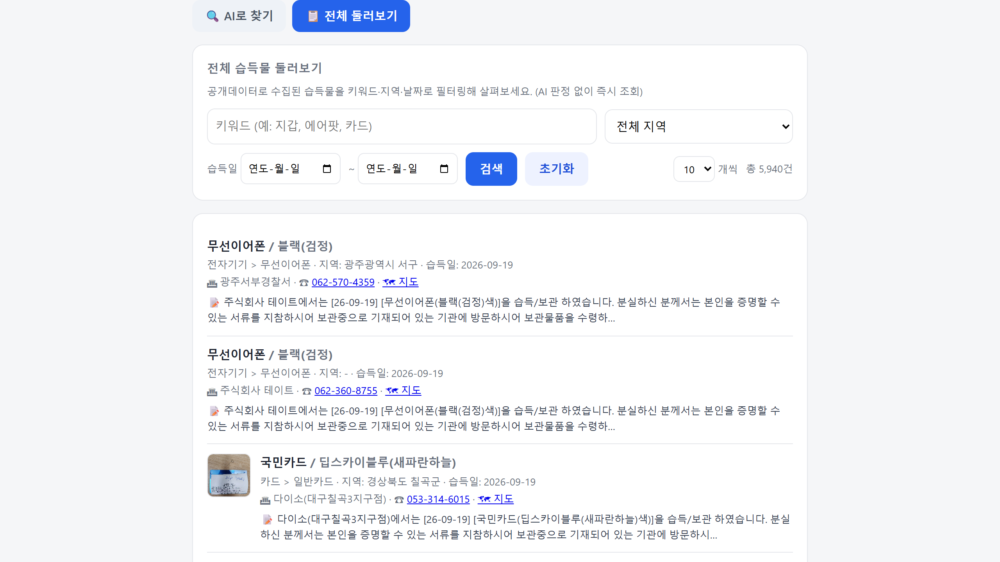
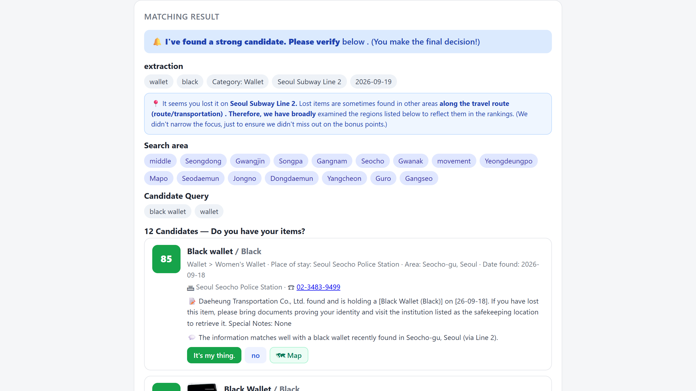
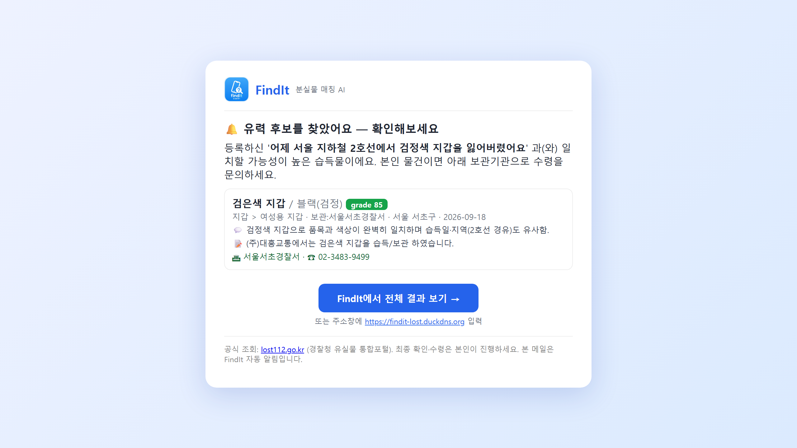

# FindIt — 분실물 매칭 AI 에이전트

> **해결하는 문제**: 습득물 공개데이터가 있어도 **검색·이용이 불편하다** — 키워드라 표현이 조금만 달라도 못 찾고,
> 매번 직접 뒤져봐야 하며, 잃어버린 장소가 불확실하거나 외국인이면 더 어렵다.

분실물을 **자연어·사진으로** 검색하면, 경찰청·포털 **습득물 공개데이터**에서 **의미 기반(임베딩) + LLM 판정**으로
매칭하고 **근거·수령 안내·알림**까지 주는 서비스. 기존 관공서 검색보다 **더 쉽고 접근성 있게** 분실물을 찾도록.
(4주 사이드 프로젝트/포트폴리오 — 코드 품질과 **설계 근거 문서화** 중시)

> 🚀 **라이브 데모**: https://findit-lost.duckdns.org 🔒 *(심사 기간 한시 운영)*
> — 예: *"어제 서울 2호선에서 검정 지갑 잃어버렸어요"* 검색, **또는 📷 사진 업로드**(Vision 특징추출) →
> 유력 후보 + **근거** + (사진 있으면) 썸네일 → *[내 물건이에요]* 시 보관기관·전화·지도·lost112 안내.
> 🌐 **다국어** — 어떤 언어로 검색해도 결과, 화면·수령안내도 여러 언어(외국인도 이용).
>
> 📄 모든 결정·실험·수치는 [`docs/PROGRESS.md`](docs/PROGRESS.md), 배포는 [`docs/DEPLOY.md`](docs/DEPLOY.md).



---

## 왜 FindIt? (경찰민원24·lost112 대비)

공식 서비스도 습득물 검색·신고·알림을 한다. FindIt은 그 **공개데이터 위에, 훨씬 쉽고 정확하게 찾도록 "접근성"을 얹는다**:

- **말하듯 검색 + 의미 매칭** — *"어제 2호선에서 검정 지갑"* 처럼 자연어로. 키워드가 아니라 **뜻**으로 찾아 표현이 달라도·오타·한↔영 커버(BM25 MRR 0.63 → 임베딩 **0.96**).
- **왜 후보인지 근거(LLM) + 📷 사진 검색(Vision)** — 목록만 주는 관공서와 달리 **판단 근거**·사진 대조까지.
- **장소가 불확실해도** — 노선 경유 지역까지 넓혀 순위에 반영하고 *왜* 그 지역들을 봤는지 **설명**.
- **안 찾아봐도 알림** — 신고를 저장해두면 새 습득물 유입마다 자동 재매칭 → **이메일 알림**.
- **다국어(외국인 접근성)** — 관공서는 한국어로만 검색되지만(영어로 치면 0건), FindIt은 **어떤 언어로 검색해도** 결과 + 화면·수령안내 다국어.

> 포지셔닝: 관공서 데이터를 **대체가 아니라 보완** — 더 똑똑한 검색·매칭 + 접근성 레이어. 실제 수령·권리는 관공서 소관 → **HITL(사용자 확인)** 유지.

---

## 📸 화면

| AI 매칭 결과 (근거·전화·지도) | 전체 둘러보기 (필터·목록) |
|:---:|:---:|
| [](docs/screenshots/ai-match.png) | [](docs/screenshots/browse.png) |
| **다국어 검색** (영어로도 결과·근거) | **이메일 알림** (매칭 시 발송) |
| [](docs/screenshots/multilingual.png) | [](docs/screenshots/email.png) |

> [내 물건이에요] 확인 시 수령 안내(전화·여권 지참 방문·지도·lost112): [`docs/screenshots/retrieval.png`](docs/screenshots/retrieval.png)

---

## 현재 상태

**✅ 동작하는 전체 파이프라인** (자연어 신고 → 매칭 → 저장 → 지속 재매칭 → 알림 → 웹)
```
수집기(data.go.kr) → OpenSearch 색인 → 검색+지역가점 → LLM grading → 매칭 에이전트(LangGraph)
                                                                    ↓
              웹 화면 ← 알림(Notifier) ← 지속 재매칭 ← 분실물 DB(SQLite)
```
- **매칭 에이전트**: `POST /lost-items`(자연어 한 줄 → 매칭) · `POST /lost-items/image`(📷 사진 → Vision 특징추출 → 매칭)
- **전체 둘러보기**: `GET /found-items/browse` — 키워드·지역·날짜 필터 + 최신순 목록(임베딩·LLM 없이 즉시)
- **웹**: 랜딩(소개) + 탭 `[🔍 AI로 찾기 | 📋 전체 둘러보기]` — 등록/사진 → 매칭 결과(근거·썸네일·지도) → HITL 확인 → 최근 신고 목록
- **다국어**: 어떤 언어로 검색해도 결과(서버가 검색어 번역) + 화면·수령안내 다국어(Google 번역 위젯)
- **지속 재매칭 + 알림**: 신고 저장(open) → 새 습득물 유입마다 재매칭 → 성립 시 **이메일 알림**(로고·매칭 근거·사이트 버튼 포함)

**✅ 검색 품질 실측 (eval, 골든셋 29문항)**

| 방식 | R@1 | R@5 | MRR |
|------|:---:|:---:|:---:|
| BM25 (nori) | 0.517 | 0.793 | 0.633 |
| **의미 임베딩 (KNN)** | **0.931** | **1.000** | **0.960** |

→ 의미 임베딩이 주력 랭커(한글↔영문·번역·오타 커버). **지역 가점**은 밀집 군집(검정지갑 193건 등)에서
묻힌 정답을 MRR 0.084→0.857로 끌어올림(덧셈 소프트 w≈0.05, eval 검증). dep→구/시 gazetteer+지오코딩 커버 **95%**.

**✅ 테스트**: `uv run pytest` — 핵심 로직 28개(fan-out·지역가점·store 생애주기·정규화·notifier·검색 부스트·API), 외부서비스 불필요(목킹).

**⏳ 남은 것**: 카카오 알림톡(현재 이메일/콘솔 알림) · 브라우저 확장 · 인증(user_id) · React/Vercel 프론트 분리 · 이미지 임베딩(CLIP) 검색.

---

## 아키텍처 원칙 (핵심)

- **채널 독립 코어** — 비즈니스 로직에 카카오/웹 의존성 금지. 알림은 `Notifier` 인터페이스로만.
- **장소·시간은 하드필터가 아니라 가점(boosting)** — 조건은 정답을 좁히는 게 아니라 순위를 정하는 점수.
- **되돌릴 수 없는 액션(공식 신고)은 HITL** — 자동화 금지, 사용자 승인 유지.
- **공공 API 필드는 `fixtures/responses/` 샘플이 진실** — 추측으로 필드명 만들지 않음.

## 기술 스택

Python 3.12 · FastAPI · LangGraph · Gemini API(embedding·grading·**Vision 이미지 추출**·검색어 번역) ·
OpenSearch(nori, 768-dim HNSW KNN) · PostgreSQL(배포) / SQLite(로컬) · 바닐라 JS 웹(랜딩+**다국어**) ·
Docker Compose · **Caddy(자동 HTTPS)** · **GitHub Actions(자동배포)** · pytest · uv · ruff

## 레포 구조

```
eval/        골든셋 + 성능 실험 (BM25/임베딩/하이브리드/스윕, OpenSearch 색인·검색·데모)
infra/       docker-compose + OpenSearch(nori) Dockerfile + 인덱스 매핑
fixtures/    공공 API 실응답 샘플 (진실의 원천)
docs/        PROGRESS.md (설계·실험 기록)
apps/api/       FastAPI 엔드포인트 (/found-items/search·/browse, /lost-items[+/image], /confirm·/dismiss·/email, /health, GET /)
apps/agent/     매칭 에이전트 (LangGraph: extract→route→fanout→search→grade) + rematch(지속 재매칭)
apps/collector/ 수집기 (data.go.kr 습득물 → 상세 enrich → 임베딩 → 색인, --rematch)
apps/store.py   분실물 저장소 (PostgreSQL/SQLite 이중 백엔드, DATABASE_URL로 선택)
apps/notifier.py 알림 (Notifier 인터페이스 + ConsoleNotifier, 추후 KakaoNotifier)
apps/web/       웹 화면 (단일 페이지, FastAPI가 GET /로 서빙)
```
> `apps/extension`(브라우저 확장)은 다음 단계 예정.

## 실행

**1. 사전 준비**: Docker Desktop, [uv](https://docs.astral.sh/uv/), `.env` 작성 ([`.env.example`](.env.example) 참고)
```bash
uv sync   # .venv + 의존성(fastapi/uvicorn/langgraph 등)
```

**2. OpenSearch(nori) 기동 + 인덱스**
```bash
docker compose -f infra/docker-compose.yml up -d --build
curl -X PUT localhost:9200/found_items -H "Content-Type: application/json" \
  --data-binary @infra/opensearch/mappings/found_items.json      # 최초 1회
python eval/index_opensearch.py                                   # 캐시 임베딩으로 시드 색인(선택)
```

**3. 앱(API+웹) 실행** → 브라우저에서 http://localhost:8000
```bash
uv run uvicorn apps.api.main:app --reload      # /docs 에 API 문서
```

**4. 수집기 (실 데이터 갱신, 선택)** — 스케줄과 무관한 CLI. 색인 후 지속 재매칭까지:
```bash
uv run python -m apps.collector.run --source both --start 20260901 --end 20260901 --max 200 --enrich --rematch
```

**성능 실험(eval)**: `python eval/run_os.py`(OpenSearch 실측) · `python eval/run_boost.py`(지역 가점) ·
`python eval/run_grade.py`(LLM grading). 상세는 [`docs/PROGRESS.md`](docs/PROGRESS.md).

> Windows에서 콘솔 한글/이모지 깨짐 방지: `PYTHONUTF8=1` 권장.

---

*설계 결정의 배경과 모든 실험 수치는 [`docs/PROGRESS.md`](docs/PROGRESS.md)를 참고하세요.*
